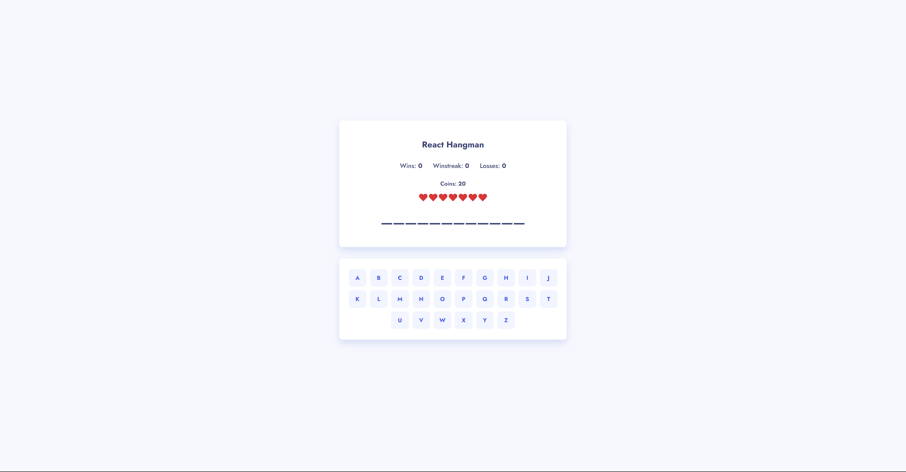

# Modern Hangman

This is a modern take on the classic game Hangman. This can be played on desktop or mobile in the browser.

## Table of contents

- [Overview](#overview)
  - [Description](#description)
  - [Screenshot](#screenshot)
  - [Links](#links)
- [My process](#my-process)
  - [Built with](#built-with)
  - [What I learned](#what-i-learned)
  - [Useful resources](#useful-resources)
- [Author](#author)

## Overview

### Description

This version of Hangman uses a list of "Software Development" keywords. Players can take a guess at a letter. If that guess is wrong they lose a life. If it is correct then the letter is revealed. Players unlock coins by winning games and can spend those coins on hints for future rounds.

### Screenshot

### Links

- Live Site URL: [https://aaron-soto.github.io/react-hangman/](https://aaron-soto.github.io/react-hangman/)

## My process

### Built with

- [React](https://reactjs.org/) - JS library
- SCSS with custom mixins and variables
- useContext, useState, useEffect hooks

### What I learned

I created a store to keep track of the state of the game through each of the components. It was good to learn how to properly pass state around an app without passing state up.

### Useful resources

- [React Js Docs](https://reactjs.org/docs/hooks-reference.html#usecontext) - I went straight to the source for this one and went through the react docs.

## Author

- Website - [Aaron Soto](https://aaronsoto.io)
- Github - [@aaron-soto](https://github.com/aaron-soto)
- Linkedin - [@aaron-soto1](https://www.linkedin.com/in/aaron-soto1/)
